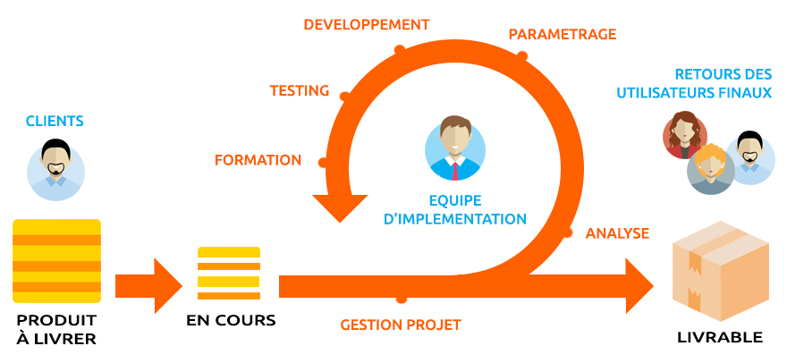
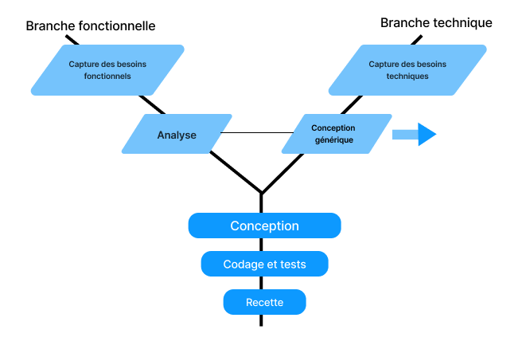
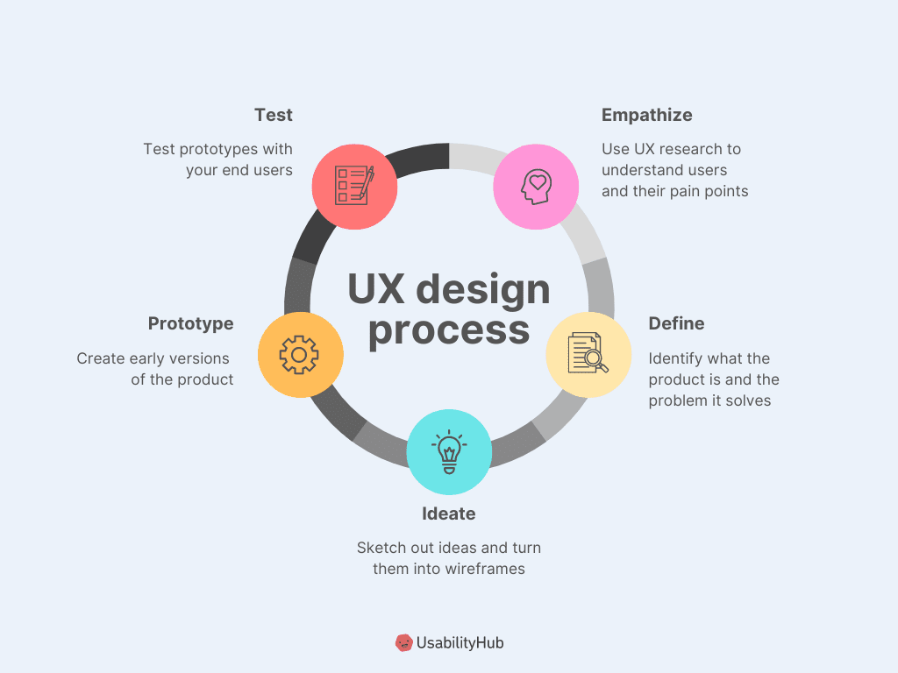
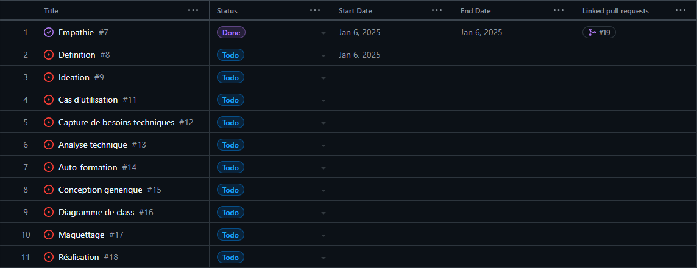
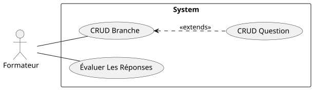
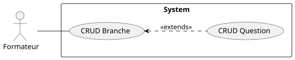

    
    

## **Entretien d'inscription**

### **Projet Fil Rouge**

- présenté par: SUIRITA Fahd
- Encadré par: ESSARRAJ Fouad

---

### **1. Introduction:**

---

### **2. Contexte du projet:**

---

### **3. Methode de travail:**

- 3.1. Scrum
- 3.2. 2TUP
- 3.3. UX design

|||

#### **3.1. Scrum:**

|||

#### **3.2. 2TUP:**

|||

#### **3.3. UX design:**

---

### **4. Planification:**

---

### **5. Branche fonctionnelle:**

- 5.1. Carte d’empathie
- 5.2. Définir le problème
- 5.3. Idéation
- 5.4. Diagramme de cas d’utilisation sprint 1
- 5.5. Diagramme de cas d’utilisation sprint 2

|||

#### **5.1. Carte d’empathie:**

|||

#### **5.2. Définir le problème:**

il est difficile d'évaluer efficacement les performances des étudiants lors des entretiens d'inscription

|||

#### **5.3. Idéation:**

|||

#### **5.4. Diagramme de cas d’utilisation sprint 1:**

|||

#### **5.5. Diagramme de cas d’utilisation sprint 2:**

---

### **6. Branche technique:**

|||

#### **6.1. Capture de besoins techniques:**

- Backend
- Frontend
- UI UX
- Base de données
- Deployment

|||

#### **6.2. Analyse technique:**

- Les Base de UI UX
- One page application (AJAX)

|||

#### **6.3. Auto-formation:**

- Composant UI

|||

#### **6.4. Conception generique:**

<!-- diagram de class on bleu ciel -->

---

### **7. Conception:**

|||

#### **7.1. Diagramme de class:**

|||

#### **7.2. Maquettage 1:**

|||

#### **7.3. Maquettage 2:**

|||

#### **7.4. Maquettage 3:**

---

### **8. Réalisation:**

---

### **9. Conclusion:**
