# Branche fonctionnelle

## Carte d’empathie

## Définir le problème

## Idéation

## Diagramme de cas d’utilisation general

## Diagramme de cas d’utilisation sprint 1

## Diagramme de cas d’utilisation sprint 2
