# Branche technique

## Capture de besoins techniques

- UI UX
- Frontend
- Backend
- Base de données
- Deployment

## Analyse technique

- Les Base de UI UX
- One page application (AJAX)

## Auto-formation

- Composant UI

## Conception generique

